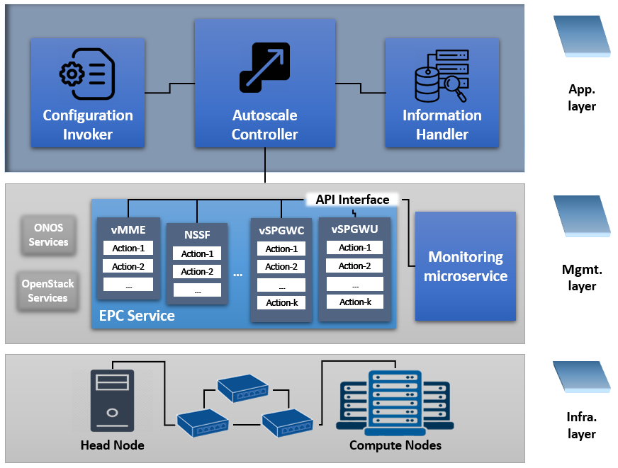
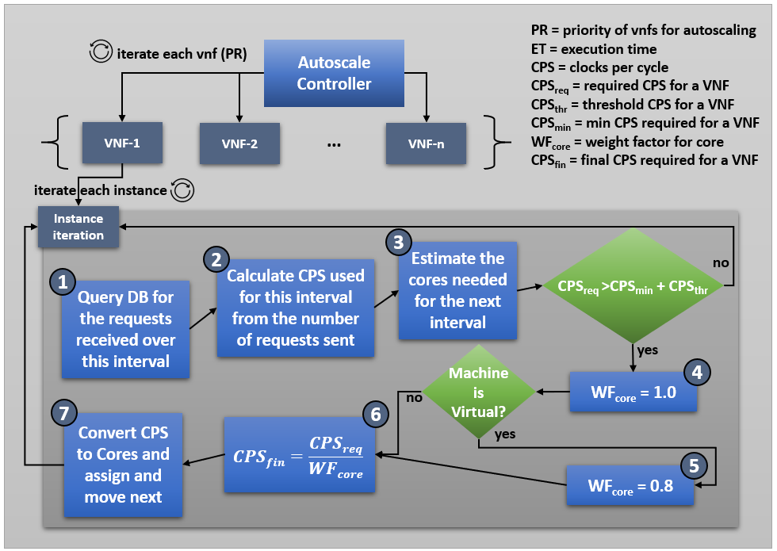
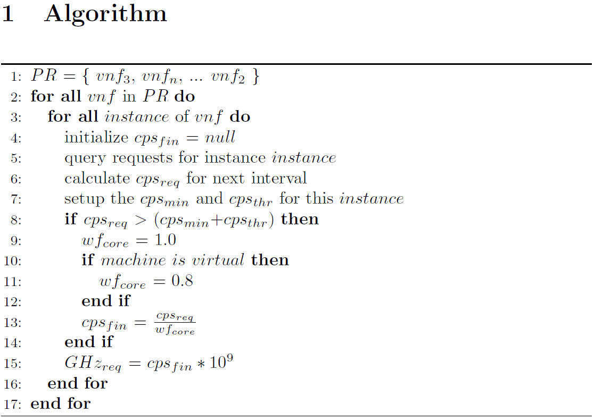

# Autoscaling Algorithm
This is a pseudo code representation of an autoscaling algorithm that was implemeneted and tested with the M-CORD Framework

# Architecture

A three layered architecture represnetation of the whole system with which our autoscaling algorithm was implemented.

# Flow Chart Representation

Following is the process flow for the autoscaling algorithm.

# Algorithm

This is an algorithmic representation of previously mentioned flowchart.

# Database

This is the database erd diagram for the implemented database.

# Pseudocode

A psuedocode representation of our autoscaling algorithm is present in the main directory. i.e. file named as *autoscaling.py*